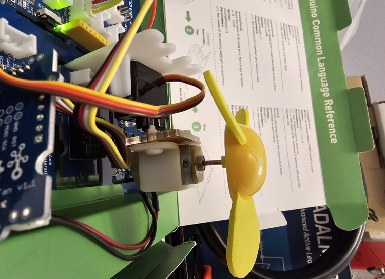

# Project 10 - Measuring the speed of a mini fan

## Goals
1. Learn about the DC motor and how to control its speed using our hardware
2. Utilize the speed of the Arduino to perform a time sensitive task
2. Display and log data in realtime using a GUI

## Requirements
2. Think of a setup that utilizes our hardware to measure the speed of a mini fan
3. develop an Arduino sketch that reads the speed of the fan and sends it to the computer
4. develop a Python script that reads the speed of the fan from the Arduino board and displays it in a GUI
5. The python script should log the fan speed into a csv file
6. find a method to control the speed of the fan using our hardware

## Resources
## DC motor
 - https://www.youtube.com/watch?v=CWulQ1ZSE3c&ab_channel=JaredOwen how DC motors works

## System setup
 - https://wiki.seeedstudio.com/Grove-Beginner-Kit-for-Arduino-education-pack/#project-2-oscillating-fan. Place fan above light sensor (images)

 ## Results
    1. Paste here the screenshot of the GUI that shows the speed of the fan in real-time.
    2. Add the corresponding csv files of the fan speed to the project folder.